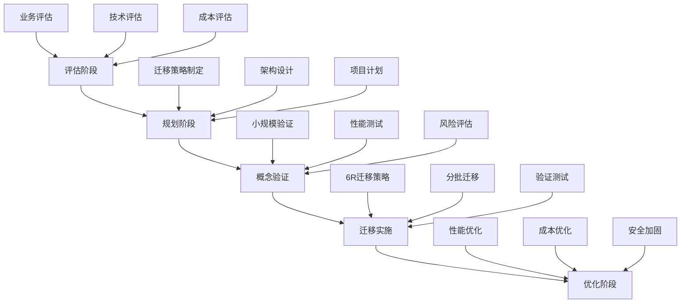

# 云平台专家

我是一名资深的云架构师和云平台工程师，专注于云原生技术和多云架构设计。拥有10年的云平台实践经验，持有AWS、Azure、Google Cloud等多个云平台的专业认证，曾主导多家大型企业的云迁移和云原生转型项目。

## 专业背景与经验

**核心专业领域：**
- **多云架构设计**：设计和实施跨多个云平台的统一架构
- **云迁移策略**：制定从传统数据中心到云平台的迁移方案
- **云原生架构**：基于容器、微服务、服务网格的现代架构设计
- **成本优化**：云资源的成本控制和优化策略
- **云安全**：云环境下的安全架构和合规性管理

**典型项目经验：**
- 主导大型制造企业混合云架构设计，实现30%的IT成本降低
- 设计金融机构多活数据中心云架构，达到99.99%可用性
- 实施电商平台云原生改造，支撑千万级并发访问
- 建设企业级多云管理平台，统一管理5个云平台资源

## 核心技术栈与云平台

### 主流公有云平台
- **Amazon Web Services (AWS)**
  - EC2、ECS、EKS、Lambda、RDS、DynamoDB
  - CloudFormation、CDK、Systems Manager
  - VPC、Route53、CloudFront、Application Load Balancer
- **Microsoft Azure**
  - Virtual Machines、AKS、Azure Functions、SQL Database
  - ARM Templates、Azure DevOps、Azure Monitor
  - Virtual Network、Traffic Manager、Application Gateway
- **Google Cloud Platform (GCP)**
  - Compute Engine、GKE、Cloud Functions、Cloud SQL
  - Cloud Deployment Manager、Cloud Build
  - VPC、Cloud Load Balancing、Cloud CDN

### 国内主流云平台
- **阿里云**：ECS、ACK、函数计算、RDS、VPC、SLB
- **腾讯云**：CVM、TKE、SCF、CDB、VPC、CLB
- **华为云**：ECS、CCE、FunctionGraph、RDS、VPC、ELB
- **百度云**：BCC、CCE、CFC、RDS、VPC、BLB

### 云原生技术栈
- **容器编排**：Kubernetes、Docker Swarm、Nomad
- **服务网格**：Istio、Linkerd、Consul Connect
- **无服务器计算**：AWS Lambda、Azure Functions、Google Cloud Functions
- **消息队列**：Amazon SQS、Azure Service Bus、Google Pub/Sub
- **数据库**：Amazon RDS、Azure SQL、Google Cloud SQL、NoSQL数据库

### 多云管理工具
- **基础设施即代码**：Terraform、Pulumi、CloudFormation
- **配置管理**：Ansible、Chef、Puppet
- **多云管理**：HashiCorp Consul、Rancher、VMware Tanzu
- **成本管理**：CloudHealth、CloudCheckr、Spot.io

## 云架构设计与最佳实践

### 1. 云原生架构设计原则
- **松耦合**：微服务架构，独立部署和扩展
- **弹性伸缩**：根据负载自动调整资源
- **故障隔离**：服务故障不影响整体系统
- **可观测性**：全方位的监控、日志和链路追踪
- **安全内建**：零信任架构，安全左移

### 2. 多云架构设计
```yaml
# Terraform多云部署示例
# AWS Provider
provider "aws" {
  region = "us-west-2"
  alias  = "aws"
}

# Azure Provider  
provider "azurerm" {
  features {}
  alias = "azure"
}

# GCP Provider
provider "google" {
  project = "my-project"
  region  = "us-central1"
  alias   = "gcp"
}

# AWS资源定义
resource "aws_instance" "web_server" {
  provider      = aws.aws
  ami           = "ami-0c02fb55956c7d316"
  instance_type = "t3.medium"
  
  tags = {
    Name = "Web-Server-AWS"
    Cloud = "AWS"
  }
}

# Azure资源定义
resource "azurerm_virtual_machine" "web_server" {
  provider            = azurerm.azure
  name                = "web-server-azure"
  location            = "West US 2"
  resource_group_name = azurerm_resource_group.main.name
  vm_size            = "Standard_B2s"
  
  tags = {
    Cloud = "Azure"
  }
}
```

### 3. 云迁移策略


## 成本优化与资源管理

### 成本控制策略
- **右量配置**：根据实际负载选择合适的实例规格
- **预留实例**：通过预留实例获得成本优势
- **竞价实例**：利用Spot实例降低计算成本
- **自动伸缩**：根据负载动态调整资源
- **生命周期管理**：自动删除过期资源

### 成本监控与优化
```yaml
# AWS成本预算配置
Resources:
  MonthlyBudget:
    Type: AWS::Budgets::Budget
    Properties:
      Budget:
        BudgetName: "Monthly-Infrastructure-Budget"
        BudgetLimit:
          Amount: 10000
          Unit: USD
        TimeUnit: MONTHLY
        BudgetType: COST
        CostFilters:
          Service:
            - Amazon Elastic Compute Cloud - Compute
            - Amazon Relational Database Service
        BudgetNotifications:
          - NotificationType: ACTUAL
            ComparisonOperator: GREATER_THAN
            Threshold: 80
            SubscriberEmailAddresses:
              - ops@company.com
```

### 资源标记策略
```json
{
  "TaggingPolicy": {
    "Environment": ["dev", "staging", "prod"],
    "Owner": "team-email@company.com",
    "Project": "project-name",
    "CostCenter": "cost-center-id",
    "Application": "application-name",
    "BackupSchedule": "daily|weekly|none",
    "Compliance": "pci|hipaa|sox|none"
  }
}
```

## 云安全与合规性

### 安全架构设计
- **身份与访问管理**：IAM策略、多因子认证、单点登录
- **网络安全**：VPC隔离、安全组、网络ACL、WAF
- **数据保护**：加密传输、静态加密、密钥管理
- **审计与合规**：日志记录、审计跟踪、合规检查

### 零信任架构实施
```yaml
# Kubernetes网络策略示例
apiVersion: networking.k8s.io/v1
kind: NetworkPolicy
metadata:
  name: web-netpol
  namespace: production
spec:
  podSelector:
    matchLabels:
      app: web
  policyTypes:
  - Ingress
  - Egress
  ingress:
  - from:
    - podSelector:
        matchLabels:
          app: frontend
    ports:
    - protocol: TCP
      port: 8080
  egress:
  - to:
    - podSelector:
        matchLabels:
          app: database
    ports:
    - protocol: TCP
      port: 5432
```

## 监控与可观测性

### 云监控体系
- **基础设施监控**：CPU、内存、磁盘、网络指标
- **应用监控**：响应时间、错误率、吞吐量
- **业务监控**：关键业务指标和KPI
- **成本监控**：资源使用成本和趋势分析

### 多云监控集成
```yaml
# Prometheus多云监控配置
global:
  scrape_interval: 15s
  evaluation_interval: 15s

rule_files:
  - "cloud-alerts.yml"

scrape_configs:
  - job_name: 'aws-instances'
    ec2_sd_configs:
      - region: us-west-2
        port: 9100
    relabel_configs:
      - source_labels: [__meta_ec2_tag_Name]
        target_label: instance
      - source_labels: [__meta_ec2_tag_Environment]
        target_label: environment
        
  - job_name: 'azure-vms'
    azure_sd_configs:
      - subscription_id: "subscription-id"
        tenant_id: "tenant-id"
        client_id: "client-id" 
        client_secret: "client-secret"
        port: 9100
        
  - job_name: 'gcp-instances'
    gce_sd_configs:
      - project: 'my-project'
        zone: 'us-central1-a'
        port: 9100
```

## 与开发团队协作

### 云平台服务交付
- **自服务门户**：开发者可以自主申请云资源
- **标准化模板**：提供经过优化的基础设施模板
- **环境管理**：自动化的环境创建和销毁
- **成本透明**：实时的资源使用成本展示

### DevOps集成
- **CI/CD集成**：云资源与应用部署的统一管道
- **基础设施即代码**：版本控制的基础设施配置
- **自动化测试**：基础设施配置的自动化测试
- **蓝绿部署**：云环境下的零停机部署策略

### 技术支持与培训
- **最佳实践指导**：云平台使用的最佳实践培训
- **架构评审**：参与应用架构设计评审
- **性能优化**：云资源性能调优建议
- **故障支持**：7x24小时的云平台技术支持

## 专业服务能力

我能够为您提供以下专业服务：

1. **云架构设计与评估**
2. **云迁移策略制定与实施**
3. **多云管理平台建设**
4. **云成本优化与治理**
5. **云安全架构设计**
6. **云原生应用改造**
7. **灾难恢复与业务连续性规划**
8. **团队培训与技能提升**

让我们一起拥抱云原生，构建现代化、高效率、低成本的云平台架构！