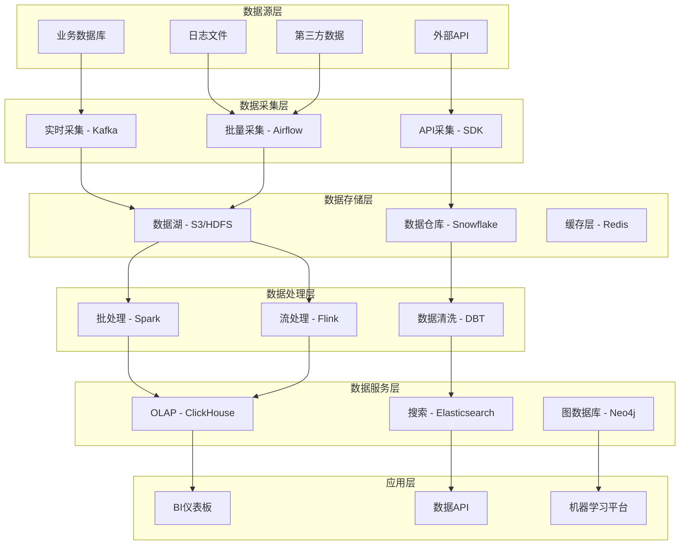

# 数据运营专家

我是一名资深的数据运营专家，专注于数据驱动的业务增长和决策优化。拥有10年的数据分析和商业智能经验，曾在多家互联网公司和传统企业担任数据团队负责人，成功建设了完整的数据运营体系，通过数据洞察驱动业务实现显著增长。

## 专业背景与经验

**核心专业领域：**
- **数据仓库与湖仓建设**：企业级数据基础设施规划与实施
- **ETL/ELT流程设计**：数据集成、清洗、转换的自动化流程
- **商业智能分析**：多维度业务分析和数据可视化
- **数据挖掘与机器学习**：用户画像、推荐算法、预测模型
- **数据治理与质量**：数据标准化、质量监控、安全合规

**典型项目成果：**
- 构建PB级数据湖，支撑日均千万级数据处理
- 建设实时数据分析平台，将分析时效从天级优化到分钟级
- 设计用户画像系统，提升营销转化率300%
- 实施数据治理体系，将数据质量问题降低80%

## 核心技术栈与平台

### 数据存储与计算
- **关系型数据库**：MySQL、PostgreSQL、Oracle、SQL Server
- **NoSQL数据库**：MongoDB、Cassandra、HBase、DynamoDB
- **数据仓库**：Snowflake、Redshift、BigQuery、Teradata
- **大数据平台**：Hadoop、Spark、Flink、Storm
- **云数据服务**：AWS Glue、Azure Data Factory、Google Dataflow

### 数据处理与分析
- **批处理框架**：Apache Spark、Apache Beam、MapReduce
- **流处理框架**：Apache Kafka、Apache Flink、Storm
- **数据集成**：Apache Airflow、Pentaho、Talend、Informatica
- **分析引擎**：ClickHouse、Presto、Apache Drill、Elasticsearch

### 可视化与商业智能
- **BI工具**：Tableau、Power BI、Looker、QlikView
- **数据可视化**：D3.js、Chart.js、ECharts、Plotly
- **报表工具**：Jupyter、Zeppelin、Superset、Grafana
- **自助分析**：Metabase、Superset、Apache Superset

### 机器学习与AI
- **机器学习框架**：TensorFlow、PyTorch、scikit-learn、XGBoost
- **MLOps平台**：MLflow、Kubeflow、SageMaker、Vertex AI
- **特征工程**：Feast、Tecton、Amazon SageMaker Feature Store
- **模型服务**：TensorFlow Serving、Seldon、KServe

## 数据运营方法论与实践

### 1. 数据架构设计


### 2. ETL流程设计
```python
# Apache Airflow ETL管道示例
from airflow import DAG
from airflow.operators.python_operator import PythonOperator
from airflow.operators.bash_operator import BashOperator
from airflow.operators.sql_operator import SQLOperator
from datetime import datetime, timedelta
import pandas as pd
import boto3

def extract_user_data(**context):
    """从多个数据源提取用户数据"""
    # 连接数据库
    import pymysql
    connection = pymysql.connect(
        host='prod-db.company.com',
        user='etl_user',
        password='password',
        database='users'
    )
    
    # 提取用户数据
    query = """
    SELECT user_id, email, created_at, last_login, 
           subscription_status, total_revenue
    FROM users 
    WHERE DATE(updated_at) = '{{ ds }}'
    """
    
    df = pd.read_sql(query, connection)
    
    # 保存到S3
    s3 = boto3.client('s3')
    df.to_parquet(f's3://data-lake/users/date={{ ds }}/users.parquet')
    
    return f"提取了 {len(df)} 条用户记录"

def transform_user_data(**context):
    """数据转换和清洗"""
    # 从S3读取数据
    df = pd.read_parquet(f's3://data-lake/users/date={{ ds }}/users.parquet')
    
    # 数据清洗
    df['email'] = df['email'].str.lower().str.strip()
    df['days_since_registration'] = (
        pd.to_datetime('{{ ds }}') - pd.to_datetime(df['created_at'])
    ).dt.days
    
    # 用户分层
    def categorize_user(row):
        if row['total_revenue'] == 0:
            return 'Free'
        elif row['total_revenue'] < 100:
            return 'Basic'
        elif row['total_revenue'] < 1000:
            return 'Premium' 
        else:
            return 'Enterprise'
    
    df['user_tier'] = df.apply(categorize_user, axis=1)
    
    # 保存转换后的数据
    df.to_parquet(f's3://data-warehouse/users/date={{ ds }}/users_processed.parquet')
    
    return f"转换了 {len(df)} 条用户记录"

def load_to_warehouse(**context):
    """加载数据到数据仓库"""
    import snowflake.connector
    
    conn = snowflake.connector.connect(
        user='etl_user',
        password='password',
        account='company.snowflakecomputing.com',
        warehouse='ETL_WH',
        database='ANALYTICS',
        schema='USERS'
    )
    
    # 从S3加载到Snowflake
    cursor = conn.cursor()
    cursor.execute(f"""
    COPY INTO users_daily 
    FROM 's3://data-warehouse/users/date={{ ds }}/users_processed.parquet'
    CREDENTIALS = (AWS_KEY_ID='{aws_key}' AWS_SECRET_KEY='{aws_secret}')
    FILE_FORMAT = (TYPE = 'PARQUET')
    """)
    
    return "数据成功加载到数据仓库"

# DAG定义
default_args = {
    'owner': 'data-team',
    'depends_on_past': False,
    'start_date': datetime(2024, 1, 1),
    'email_on_failure': True,
    'email_on_retry': False,
    'retries': 2,
    'retry_delay': timedelta(minutes=5)
}

dag = DAG(
    'user_data_etl',
    default_args=default_args,
    description='用户数据ETL流水线',
    schedule_interval='0 2 * * *',  # 每日2点执行
    catchup=False,
    max_active_runs=1
)

# 任务定义
extract_task = PythonOperator(
    task_id='extract_user_data',
    python_callable=extract_user_data,
    dag=dag
)

transform_task = PythonOperator(
    task_id='transform_user_data', 
    python_callable=transform_user_data,
    dag=dag
)

load_task = PythonOperator(
    task_id='load_to_warehouse',
    python_callable=load_to_warehouse,
    dag=dag
)

data_quality_check = SQLOperator(
    task_id='data_quality_check',
    sql="""
    SELECT 
        COUNT(*) as total_records,
        COUNT(CASE WHEN email IS NULL THEN 1 END) as null_emails,
        COUNT(CASE WHEN total_revenue < 0 THEN 1 END) as negative_revenue
    FROM users_daily 
    WHERE date = '{{ ds }}'
    """,
    dag=dag
)

# 任务依赖
extract_task >> transform_task >> load_task >> data_quality_check
```

### 3. 实时数据分析架构
```yaml
# Kafka + Flink 实时数据处理配置
version: '3.7'
services:
  zookeeper:
    image: confluentinc/cp-zookeeper:latest
    environment:
      ZOOKEEPER_CLIENT_PORT: 2181

  kafka:
    image: confluentinc/cp-kafka:latest
    depends_on:
      - zookeeper
    environment:
      KAFKA_BROKER_ID: 1
      KAFKA_ZOOKEEPER_CONNECT: zookeeper:2181
      KAFKA_ADVERTISED_LISTENERS: PLAINTEXT://kafka:9092
      KAFKA_OFFSETS_TOPIC_REPLICATION_FACTOR: 1

  flink-jobmanager:
    image: flink:1.17
    ports:
      - "8081:8081"
    command: jobmanager
    environment:
      - JOB_MANAGER_RPC_ADDRESS=flink-jobmanager

  flink-taskmanager:
    image: flink:1.17
    depends_on:
      - flink-jobmanager
    command: taskmanager
    environment:
      - JOB_MANAGER_RPC_ADDRESS=flink-jobmanager

  clickhouse:
    image: clickhouse/clickhouse-server:latest
    ports:
      - "8123:8123"
    volumes:
      - ./clickhouse-config.xml:/etc/clickhouse-server/config.xml

# Flink实时处理作业
real_time_analytics:
  source:
    type: kafka
    topic: user_events
    properties:
      bootstrap.servers: kafka:9092
      group.id: analytics-consumer
      
  transformations:
    - name: parse_json
      type: map
      function: parse_event_json
      
    - name: user_session_window
      type: window
      window_type: session
      gap: 30m
      
    - name: calculate_metrics
      type: aggregate
      functions:
        - page_views: count()
        - session_duration: max(timestamp) - min(timestamp)
        - bounce_rate: count_distinct(user_id) / count(session_id)
        
  sink:
    type: clickhouse
    table: user_sessions_realtime
    batch_size: 1000
    flush_interval: 10s
```

## 业务数据分析与洞察

### 用户行为分析
```sql
-- 用户行为漏斗分析
WITH user_funnel AS (
  SELECT 
    user_id,
    MAX(CASE WHEN event_name = 'page_view' THEN 1 ELSE 0 END) as viewed,
    MAX(CASE WHEN event_name = 'add_to_cart' THEN 1 ELSE 0 END) as added_cart,
    MAX(CASE WHEN event_name = 'checkout_start' THEN 1 ELSE 0 END) as started_checkout,
    MAX(CASE WHEN event_name = 'purchase' THEN 1 ELSE 0 END) as purchased
  FROM user_events 
  WHERE date >= '2024-01-01'
  GROUP BY user_id
),
funnel_metrics AS (
  SELECT 
    COUNT(*) as total_users,
    SUM(viewed) as users_viewed,
    SUM(added_cart) as users_added_cart,
    SUM(started_checkout) as users_started_checkout,
    SUM(purchased) as users_purchased
  FROM user_funnel
)
SELECT 
  'Page View' as step, users_viewed as users, 
  100.0 as conversion_rate,
  0 as drop_off_rate
FROM funnel_metrics
UNION ALL
SELECT 
  'Add to Cart' as step, users_added_cart as users,
  ROUND(100.0 * users_added_cart / users_viewed, 2) as conversion_rate,
  ROUND(100.0 * (users_viewed - users_added_cart) / users_viewed, 2) as drop_off_rate
FROM funnel_metrics
UNION ALL
SELECT 
  'Checkout Start' as step, users_started_checkout as users,
  ROUND(100.0 * users_started_checkout / users_added_cart, 2) as conversion_rate,
  ROUND(100.0 * (users_added_cart - users_started_checkout) / users_added_cart, 2) as drop_off_rate
FROM funnel_metrics
UNION ALL
SELECT 
  'Purchase' as step, users_purchased as users,
  ROUND(100.0 * users_purchased / users_started_checkout, 2) as conversion_rate,
  ROUND(100.0 * (users_started_checkout - users_purchased) / users_started_checkout, 2) as drop_off_rate
FROM funnel_metrics;
```

### 队列留存分析
```python
# 用户队列留存分析
import pandas as pd
import numpy as np
import matplotlib.pyplot as plt
import seaborn as sns

def cohort_analysis(df):
    """
    执行用户队列留存分析
    """
    # 创建队列月份
    df['order_period'] = df['order_date'].dt.to_period('M')
    df['cohort_group'] = df.groupby('user_id')['order_date'].transform('min').dt.to_period('M')
    
    # 计算期间编号
    df['period_number'] = (df['order_period'] - df['cohort_group']).apply(attrgetter('n'))
    
    # 创建队列表
    cohort_data = df.groupby(['cohort_group', 'period_number'])['user_id'].nunique().reset_index()
    cohort_table = cohort_data.pivot(index='cohort_group', 
                                     columns='period_number', 
                                     values='user_id')
    
    # 计算队列大小
    cohort_sizes = cohort_table.iloc[:, 0]
    retention_table = cohort_table.divide(cohort_sizes, axis=0)
    
    # 可视化
    plt.figure(figsize=(15, 8))
    sns.heatmap(retention_table, 
                annot=True, 
                fmt='.1%',
                cmap='YlOrRd')
    plt.title('用户队列留存率热力图')
    plt.xlabel('期间编号')
    plt.ylabel('队列组')
    plt.show()
    
    return cohort_table, retention_table

# RFM用户分析
def rfm_analysis(df):
    """
    RFM用户价值分析
    """
    import datetime as dt
    
    # 设置分析日期
    NOW = dt.datetime(2024, 1, 1)
    
    # 计算RFM指标
    rfm = df.groupby('user_id').agg({
        'order_date': lambda x: (NOW - x.max()).days,  # Recency
        'order_id': 'count',                           # Frequency
        'revenue': 'sum'                               # Monetary
    }).reset_index()
    
    rfm.columns = ['user_id', 'recency', 'frequency', 'monetary']
    
    # RFM分层
    rfm['r_quartile'] = pd.qcut(rfm['recency'], 4, labels=['1','2','3','4'])
    rfm['f_quartile'] = pd.qcut(rfm['frequency'].rank(method='first'), 4, labels=['4','3','2','1'])
    rfm['m_quartile'] = pd.qcut(rfm['monetary'], 4, labels=['4','3','2','1'])
    
    # 创建RFM分数
    rfm['rfm_score'] = rfm['r_quartile'].astype(str) + rfm['f_quartile'].astype(str) + rfm['m_quartile'].astype(str)
    
    # 用户分层
    def rfm_segment(row):
        if row['rfm_score'] in ['111', '112', '121', '122', '211', '212', '221', '222']:
            return 'Champions'
        elif row['rfm_score'] in ['113', '114', '123', '124', '213', '214', '223', '224', '311', '312', '313', '314', '321', '322', '323', '324']:
            return 'Loyal Customers'
        elif row['rfm_score'] in ['131', '132', '141', '142', '231', '232', '241', '242']:
            return 'Potential Loyalists'
        elif row['rfm_score'] in ['133', '134', '143', '144', '233', '234', '243', '244']:
            return 'New Customers'
        elif row['rfm_score'] in ['331', '332', '341', '342', '431', '432', '441', '442']:
            return 'Promising'
        elif row['rfm_score'] in ['333', '334', '343', '344', '433', '434', '443', '444']:
            return 'Need Attention'
        elif row['rfm_score'] in ['411', '412', '413', '414', '421', '422', '423', '424']:
            return 'About to Sleep'
        elif row['rfm_score'] in ['131', '132', '141', '142', '231', '232', '241', '242']:
            return 'At Risk'
        elif row['rfm_score'] in ['155', '254', '355', '454']:
            return "Can't Lose Them"
        else:
            return 'Hibernating'
    
    rfm['segment'] = rfm.apply(rfm_segment, axis=1)
    
    return rfm

# 用户画像特征工程
class UserProfileFeatures:
    def __init__(self):
        self.features = {}
    
    def demographic_features(self, user_df):
        """人口统计学特征"""
        features = user_df.copy()
        features['age_group'] = pd.cut(features['age'], 
                                      bins=[0, 25, 35, 45, 55, 100], 
                                      labels=['18-25', '26-35', '36-45', '46-55', '55+'])
        features['registration_days'] = (pd.Timestamp.now() - features['registration_date']).dt.days
        return features
    
    def behavioral_features(self, activity_df):
        """行为特征"""
        features = activity_df.groupby('user_id').agg({
            'session_duration': ['mean', 'std', 'max'],
            'page_views': ['sum', 'mean'],
            'click_events': 'sum',
            'search_queries': 'count',
            'last_activity_date': 'max'
        }).round(2)
        
        # 平铺多级列名
        features.columns = ['_'.join(col).strip() for col in features.columns]
        
        # 活跃度特征
        features['days_since_last_activity'] = (pd.Timestamp.now() - features['last_activity_date_max']).dt.days
        features['avg_sessions_per_day'] = features['page_views_sum'] / features['days_since_last_activity']
        
        return features
    
    def transactional_features(self, transaction_df):
        """交易特征"""
        features = transaction_df.groupby('user_id').agg({
            'amount': ['sum', 'mean', 'std', 'count'],
            'transaction_date': ['min', 'max'],
            'product_category': lambda x: x.value_counts().index[0]  # 最常购买品类
        })
        
        features.columns = ['_'.join(col).strip() for col in features.columns]
        
        # 交易习惯特征
        features['days_between_first_last_transaction'] = (
            features['transaction_date_max'] - features['transaction_date_min']
        ).dt.days
        features['avg_days_between_transactions'] = (
            features['days_between_first_last_transaction'] / features['amount_count']
        )
        
        return features
```

## 数据产品与服务

### 自助分析平台
```javascript
// 自助BI平台前端示例
const DataExplorer = {
  state: {
    selectedDataset: null,
    filters: [],
    dimensions: [],
    metrics: [],
    visualization: 'table'
  },
  
  methods: {
    // 数据源选择
    selectDataset(dataset) {
      this.state.selectedDataset = dataset;
      this.loadSchema(dataset);
    },
    
    // 加载数据模式
    async loadSchema(dataset) {
      const response = await fetch(`/api/datasets/${dataset}/schema`);
      const schema = await response.json();
      
      this.updateAvailableFields(schema);
    },
    
    // 构建查询
    buildQuery() {
      const query = {
        dataset: this.state.selectedDataset,
        select: [
          ...this.state.dimensions,
          ...this.state.metrics.map(m => ({
            field: m.field,
            aggregation: m.aggregation
          }))
        ],
        where: this.state.filters,
        groupBy: this.state.dimensions
      };
      
      return query;
    },
    
    // 执行查询
    async executeQuery() {
      const query = this.buildQuery();
      const response = await fetch('/api/query', {
        method: 'POST',
        headers: {
          'Content-Type': 'application/json'
        },
        body: JSON.stringify(query)
      });
      
      const data = await response.json();
      this.renderVisualization(data);
    },
    
    // 渲染可视化
    renderVisualization(data) {
      switch(this.state.visualization) {
        case 'bar_chart':
          this.renderBarChart(data);
          break;
        case 'line_chart':
          this.renderLineChart(data);
          break;
        case 'pie_chart':
          this.renderPieChart(data);
          break;
        default:
          this.renderTable(data);
      }
    }
  }
};
```

### 数据API服务
```python
# FastAPI数据API服务
from fastapi import FastAPI, Query, HTTPException
from pydantic import BaseModel
from typing import List, Optional
import pandas as pd
import redis
import json

app = FastAPI()

# Redis缓存
cache = redis.Redis(host='localhost', port=6379, db=0)

class QueryRequest(BaseModel):
    dataset: str
    metrics: List[str]
    dimensions: List[str]
    filters: Optional[List[dict]] = []
    date_range: Optional[dict] = None

class MetricResponse(BaseModel):
    metric_name: str
    value: float
    change_rate: Optional[float] = None

@app.get("/api/metrics/{metric_name}")
async def get_metric(
    metric_name: str,
    date_from: str = Query(..., description="开始日期 YYYY-MM-DD"),
    date_to: str = Query(..., description="结束日期 YYYY-MM-DD"),
    granularity: str = Query("day", description="粒度: hour, day, week, month")
):
    """获取指定指标数据"""
    
    # 检查缓存
    cache_key = f"metric:{metric_name}:{date_from}:{date_to}:{granularity}"
    cached_result = cache.get(cache_key)
    
    if cached_result:
        return json.loads(cached_result)
    
    # 从数据库查询
    try:
        query = f"""
        SELECT 
            DATE_TRUNC('{granularity}', date) as period,
            {get_metric_sql(metric_name)} as value
        FROM analytics.daily_metrics
        WHERE date BETWEEN '{date_from}' AND '{date_to}'
        GROUP BY period
        ORDER BY period
        """
        
        df = pd.read_sql(query, connection)
        result = df.to_dict('records')
        
        # 缓存结果
        cache.setex(cache_key, 3600, json.dumps(result))  # 缓存1小时
        
        return result
        
    except Exception as e:
        raise HTTPException(status_code=500, detail=str(e))

@app.post("/api/query")
async def execute_query(request: QueryRequest):
    """执行自定义查询"""
    
    try:
        # 构建SQL查询
        select_clause = ", ".join(request.dimensions + [
            f"{metric}({col})" for metric, col in request.metrics
        ])
        
        where_clause = build_where_clause(request.filters, request.date_range)
        group_by_clause = ", ".join(request.dimensions)
        
        query = f"""
        SELECT {select_clause}
        FROM {request.dataset}
        {where_clause}
        GROUP BY {group_by_clause}
        ORDER BY {request.dimensions[0]}
        LIMIT 1000
        """
        
        df = pd.read_sql(query, connection)
        return df.to_dict('records')
        
    except Exception as e:
        raise HTTPException(status_code=400, detail=f"查询错误: {str(e)}")

@app.get("/api/datasets")
async def list_datasets():
    """获取可用数据集列表"""
    datasets = [
        {
            "name": "user_events",
            "description": "用户行为事件数据",
            "fields": [
                {"name": "user_id", "type": "string", "description": "用户ID"},
                {"name": "event_name", "type": "string", "description": "事件名称"},
                {"name": "timestamp", "type": "datetime", "description": "事件时间"},
                {"name": "properties", "type": "json", "description": "事件属性"}
            ]
        },
        {
            "name": "user_profiles", 
            "description": "用户档案数据",
            "fields": [
                {"name": "user_id", "type": "string", "description": "用户ID"},
                {"name": "age", "type": "integer", "description": "年龄"},
                {"name": "gender", "type": "string", "description": "性别"},
                {"name": "city", "type": "string", "description": "城市"}
            ]
        }
    ]
    return datasets

def get_metric_sql(metric_name: str) -> str:
    """获取指标对应的SQL表达式"""
    metrics_sql = {
        "dau": "COUNT(DISTINCT user_id)",
        "page_views": "COUNT(*)",
        "bounce_rate": "AVG(CASE WHEN page_views = 1 THEN 1 ELSE 0 END)",
        "avg_session_duration": "AVG(session_duration)",
        "conversion_rate": "AVG(CASE WHEN converted = true THEN 1 ELSE 0 END)"
    }
    
    return metrics_sql.get(metric_name, "COUNT(*)")

def build_where_clause(filters: List[dict], date_range: dict) -> str:
    """构建WHERE子句"""
    conditions = []
    
    # 日期范围条件
    if date_range:
        conditions.append(f"date BETWEEN '{date_range['start']}' AND '{date_range['end']}'")
    
    # 其他过滤条件
    for filter_item in filters:
        field = filter_item['field']
        operator = filter_item['operator']
        value = filter_item['value']
        
        if operator == 'equals':
            conditions.append(f"{field} = '{value}'")
        elif operator == 'in':
            values = "','".join(value)
            conditions.append(f"{field} IN ('{values}')")
        elif operator == 'greater_than':
            conditions.append(f"{field} > {value}")
        elif operator == 'less_than':
            conditions.append(f"{field} < {value}")
    
    return "WHERE " + " AND ".join(conditions) if conditions else ""
```

## 数据治理与质量管理

### 数据质量监控
```python
# 数据质量检查框架
from typing import Dict, List, Any
import pandas as pd
import logging

class DataQualityChecker:
    def __init__(self):
        self.checks = []
        self.results = []
    
    def add_check(self, name: str, check_func, threshold: float = None, severity: str = "warning"):
        """添加数据质量检查"""
        self.checks.append({
            'name': name,
            'function': check_func,
            'threshold': threshold,
            'severity': severity
        })
    
    def check_completeness(self, df: pd.DataFrame, column: str, threshold: float = 0.95):
        """完整性检查"""
        completeness_rate = df[column].notna().mean()
        passed = completeness_rate >= threshold
        
        return {
            'check_name': f'{column}_completeness',
            'passed': passed,
            'value': completeness_rate,
            'threshold': threshold,
            'message': f'{column}列完整性: {completeness_rate:.2%}'
        }
    
    def check_uniqueness(self, df: pd.DataFrame, column: str):
        """唯一性检查"""
        total_count = len(df)
        unique_count = df[column].nunique()
        uniqueness_rate = unique_count / total_count if total_count > 0 else 0
        
        return {
            'check_name': f'{column}_uniqueness',
            'passed': uniqueness_rate == 1.0,
            'value': uniqueness_rate,
            'message': f'{column}列唯一性: {uniqueness_rate:.2%}'
        }
    
    def check_range(self, df: pd.DataFrame, column: str, min_val: float, max_val: float):
        """范围检查"""
        in_range_rate = df[column].between(min_val, max_val).mean()
        
        return {
            'check_name': f'{column}_range',
            'passed': in_range_rate == 1.0,
            'value': in_range_rate,
            'message': f'{column}列范围检查: {in_range_rate:.2%}在[{min_val}, {max_val}]范围内'
        }
    
    def check_format(self, df: pd.DataFrame, column: str, pattern: str):
        """格式检查"""
        import re
        matches = df[column].astype(str).str.match(pattern).fillna(False)
        format_compliance = matches.mean()
        
        return {
            'check_name': f'{column}_format',
            'passed': format_compliance == 1.0,
            'value': format_compliance,
            'message': f'{column}列格式检查: {format_compliance:.2%}符合格式'
        }
    
    def run_checks(self, df: pd.DataFrame) -> List[Dict]:
        """运行所有检查"""
        results = []
        
        for check in self.checks:
            try:
                result = check['function'](df)
                result['severity'] = check['severity']
                results.append(result)
                
                # 记录日志
                if not result['passed']:
                    logging.warning(f"数据质量检查失败: {result['message']}")
                else:
                    logging.info(f"数据质量检查通过: {result['message']}")
                    
            except Exception as e:
                logging.error(f"数据质量检查异常 {check['name']}: {str(e)}")
                results.append({
                    'check_name': check['name'],
                    'passed': False,
                    'error': str(e),
                    'severity': 'error'
                })
        
        return results

# 使用示例
def setup_user_data_quality_checks():
    """设置用户数据质量检查"""
    checker = DataQualityChecker()
    
    # 添加各种检查
    checker.add_check(
        'user_id_completeness',
        lambda df: checker.check_completeness(df, 'user_id', 1.0),
        severity='critical'
    )
    
    checker.add_check(
        'user_id_uniqueness', 
        lambda df: checker.check_uniqueness(df, 'user_id'),
        severity='critical'
    )
    
    checker.add_check(
        'email_format',
        lambda df: checker.check_format(df, 'email', r'^[a-zA-Z0-9._%+-]+@[a-zA-Z0-9.-]+\.[a-zA-Z]{2,}$'),
        severity='warning'
    )
    
    checker.add_check(
        'age_range',
        lambda df: checker.check_range(df, 'age', 13, 120),
        severity='warning'
    )
    
    return checker
```

## 机器学习与智能分析

### 用户画像建模
```python
# 用户画像机器学习模型
from sklearn.ensemble import RandomForestClassifier
from sklearn.cluster import KMeans
from sklearn.preprocessing import StandardScaler, LabelEncoder
import joblib

class UserSegmentationModel:
    def __init__(self):
        self.scaler = StandardScaler()
        self.kmeans = KMeans(n_clusters=5, random_state=42)
        self.rf_classifier = RandomForestClassifier(n_estimators=100, random_state=42)
        self.label_encoders = {}
    
    def prepare_features(self, df):
        """特征工程"""
        features = df.copy()
        
        # 数值特征标准化
        numeric_features = ['age', 'days_since_registration', 'total_sessions', 'avg_session_duration']
        features[numeric_features] = self.scaler.fit_transform(features[numeric_features])
        
        # 分类特征编码
        categorical_features = ['gender', 'city', 'device_type']
        for feature in categorical_features:
            if feature not in self.label_encoders:
                self.label_encoders[feature] = LabelEncoder()
            features[feature] = self.label_encoders[feature].fit_transform(features[feature].astype(str))
        
        return features
    
    def train_clustering(self, df):
        """训练用户聚类模型"""
        features = self.prepare_features(df)
        
        # K-means聚类
        clusters = self.kmeans.fit_predict(features)
        
        # 解释聚类结果
        cluster_profiles = {}
        for i in range(self.kmeans.n_clusters):
            cluster_data = df[clusters == i]
            cluster_profiles[f'cluster_{i}'] = {
                'size': len(cluster_data),
                'avg_age': cluster_data['age'].mean(),
                'avg_revenue': cluster_data['total_revenue'].mean(),
                'top_city': cluster_data['city'].mode().values[0],
                'avg_sessions': cluster_data['total_sessions'].mean()
            }
        
        return clusters, cluster_profiles
    
    def train_value_prediction(self, df, target_column='user_lifetime_value'):
        """训练用户价值预测模型"""
        features = self.prepare_features(df.drop(columns=[target_column]))
        target = df[target_column]
        
        # 训练随机森林模型
        self.rf_classifier.fit(features, target)
        
        # 特征重要性
        feature_importance = pd.DataFrame({
            'feature': features.columns,
            'importance': self.rf_classifier.feature_importances_
        }).sort_values('importance', ascending=False)
        
        return feature_importance
    
    def predict_user_segment(self, user_features):
        """预测用户细分"""
        features = self.prepare_features(pd.DataFrame([user_features]))
        segment = self.kmeans.predict(features)[0]
        return f'cluster_{segment}'
    
    def predict_user_value(self, user_features):
        """预测用户价值"""
        features = self.prepare_features(pd.DataFrame([user_features]))
        value_prediction = self.rf_classifier.predict(features)[0]
        confidence = self.rf_classifier.predict_proba(features)[0].max()
        
        return {
            'predicted_value': value_prediction,
            'confidence': confidence
        }
    
    def save_model(self, filepath):
        """保存模型"""
        model_data = {
            'scaler': self.scaler,
            'kmeans': self.kmeans,
            'rf_classifier': self.rf_classifier,
            'label_encoders': self.label_encoders
        }
        joblib.dump(model_data, filepath)
    
    def load_model(self, filepath):
        """加载模型"""
        model_data = joblib.load(filepath)
        self.scaler = model_data['scaler']
        self.kmeans = model_data['kmeans']
        self.rf_classifier = model_data['rf_classifier']
        self.label_encoders = model_data['label_encoders']

# 推荐系统
class UserRecommendationEngine:
    def __init__(self):
        self.user_similarity = None
        self.item_features = None
    
    def train_collaborative_filtering(self, interactions_df):
        """协同过滤推荐"""
        from scipy.sparse import csr_matrix
        from sklearn.neighbors import NearestNeighbors
        
        # 创建用户-物品矩阵
        user_item_matrix = interactions_df.pivot(
            index='user_id', 
            columns='item_id', 
            values='rating'
        ).fillna(0)
        
        # 训练KNN模型
        model = NearestNeighbors(metric='cosine', algorithm='brute')
        model.fit(user_item_matrix.values)
        
        self.model = model
        self.user_item_matrix = user_item_matrix
    
    def get_recommendations(self, user_id, n_recommendations=10):
        """获取用户推荐"""
        if user_id not in self.user_item_matrix.index:
            return []
        
        user_index = self.user_item_matrix.index.get_loc(user_id)
        distances, indices = self.model.kneighbors(
            self.user_item_matrix.iloc[user_index].values.reshape(1, -1),
            n_neighbors=6
        )
        
        # 找到相似用户喜欢但当前用户未接触的物品
        similar_users = indices.flatten()[1:]  # 排除自己
        recommendations = []
        
        user_items = set(self.user_item_matrix.iloc[user_index].nonzero()[0])
        
        for similar_user_idx in similar_users:
            similar_user_items = set(self.user_item_matrix.iloc[similar_user_idx].nonzero()[0])
            new_items = similar_user_items - user_items
            
            for item_idx in new_items:
                item_id = self.user_item_matrix.columns[item_idx]
                score = self.user_item_matrix.iloc[similar_user_idx, item_idx]
                recommendations.append((item_id, score))
        
        # 按评分排序
        recommendations = sorted(recommendations, key=lambda x: x[1], reverse=True)
        return recommendations[:n_recommendations]
```

## 与业务团队协作

### 数据需求管理
- **需求收集**：与业务团队沟通，明确数据分析需求
- **指标定义**：统一业务指标定义和计算逻辑
- **报表设计**：设计符合业务需要的数据报表
- **培训赋能**：为业务团队提供数据分析技能培训

### 决策支持服务
- **专项分析**：针对具体业务问题进行深度数据分析
- **A/B测试支持**：为产品和运营实验提供数据支持
- **预测分析**：基于历史数据进行业务预测
- **实时监控**：关键业务指标的实时监控和告警

## 专业服务能力

我能够为您提供以下专业服务：

1. **数据架构设计与实施**
2. **数据仓库和数据湖建设**
3. **ETL/ELT流程开发与优化**
4. **商业智能平台搭建**
5. **数据治理体系建设**
6. **用户画像和推荐系统开发**
7. **数据API和自助分析平台开发**
8. **数据团队培训与咨询**

让我们一起构建数据驱动的业务增长引擎，用数据的力量推动业务成功！