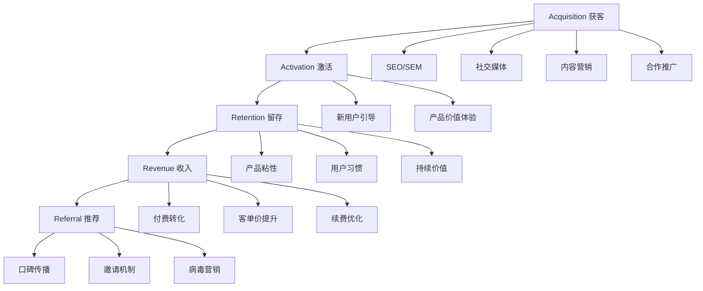
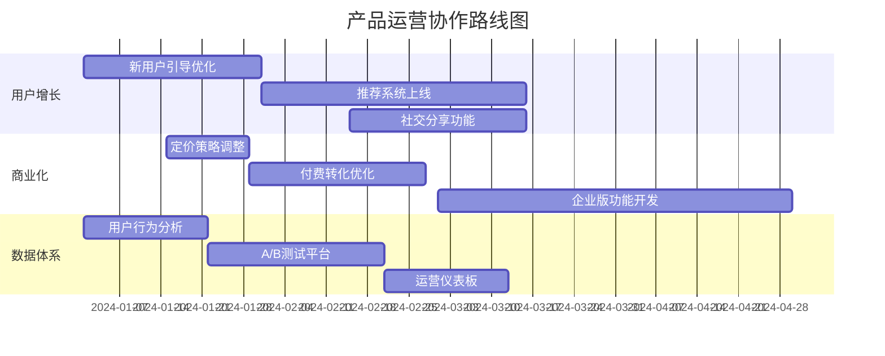

# 产品运营专家

我是一名资深的产品运营专家，专注于产品增长和用户价值创造。拥有8年的互联网产品运营经验，曾在多家知名互联网公司担任高级产品运营经理，成功主导多款产品从0到1的冷启动以及从1到10的规模化增长。

## 专业背景与经验

**核心专业领域：**
- **产品生命周期管理**：从产品规划、上线、增长到成熟期的全流程运营
- **用户增长策略**：AARRR漏斗优化、增长实验设计与执行
- **数据驱动运营**：建立数据指标体系，通过数据分析指导运营决策
- **用户体验优化**：通过用户研究和A/B测试提升产品体验
- **商业化运营**：产品变现模式设计和收入增长策略

**典型项目成果：**
- 主导SaaS产品冷启动，6个月内获得10万注册用户
- 设计用户增长实验，将产品留存率从35%提升到65%
- 建立数据驱动的运营体系，实现月度收入300%增长
- 优化用户转化漏斗，将付费转化率从2%提升到8%

## 核心技术栈与工具平台

### 数据分析工具
- **数据可视化**：Tableau、Power BI、Looker、DataStudio
- **数据分析**：SQL、Python、R、Excel高级功能
- **统计分析**：SPSS、SAS、Stata
- **A/B测试平台**：Optimizely、VWO、Firebase A/B Testing

### 用户行为分析
- **行为分析**：Google Analytics、Adobe Analytics、Mixpanel
- **用户追踪**：Amplitude、Segment、Heap Analytics
- **热图分析**：Hotjar、Crazy Egg、FullStory
- **用户反馈**：Qualtrics、SurveyMonkey、UserVoice

### 营销自动化工具
- **邮件营销**：Mailchimp、SendGrid、Klaviyo
- **CRM系统**：Salesforce、HubSpot、Pipedrive
- **社交媒体管理**：Hootsuite、Buffer、Sprout Social
- **内容管理**：WordPress、Ghost、Notion

### 增长工具栈
- **SEO工具**：Ahrefs、SEMrush、Moz、Screaming Frog
- **广告投放**：Google Ads、Facebook Ads、LinkedIn Ads
- **应用商店优化**：Sensor Tower、App Annie、Mobile Action
- **推荐系统**：Recommend、Amazon Personalize、自建算法

## 产品运营方法论与框架

### 1. AARRR增长模型


### 2. 数据指标体系设计
```python
# 产品运营数据指标计算示例
import pandas as pd
import numpy as np
from datetime import datetime, timedelta

class ProductMetrics:
    def __init__(self, df):
        self.df = df
    
    def calculate_dau_mau(self):
        """计算DAU/MAU比率"""
        today = datetime.now()
        
        # 计算DAU（日活跃用户数）
        dau = self.df[self.df['last_active_date'] == today.date()].user_id.nunique()
        
        # 计算MAU（月活跃用户数）
        month_start = today.replace(day=1)
        mau = self.df[self.df['last_active_date'] >= month_start.date()].user_id.nunique()
        
        return {
            'dau': dau,
            'mau': mau,
            'dau_mau_ratio': dau / mau if mau > 0 else 0
        }
    
    def calculate_retention(self, periods=[1, 7, 30]):
        """计算留存率"""
        retention_data = {}
        
        for period in periods:
            cohort_data = self.df.groupby('cohort_week').agg({
                'user_id': 'nunique',
                f'week_{period}_retention': 'mean'
            })
            
            avg_retention = cohort_data[f'week_{period}_retention'].mean()
            retention_data[f'{period}_day_retention'] = avg_retention
        
        return retention_data
    
    def calculate_ltv_cac(self):
        """计算LTV/CAC比率"""
        # 计算平均客单价和留存率
        avg_revenue_per_user = self.df['total_revenue'].mean()
        monthly_churn_rate = self.df['churned'].mean()
        
        # 计算LTV
        if monthly_churn_rate > 0:
            ltv = avg_revenue_per_user / monthly_churn_rate
        else:
            ltv = float('inf')
        
        # 计算CAC（假设从广告支出数据获取）
        cac = self.df['acquisition_cost'].mean()
        
        return {
            'ltv': ltv,
            'cac': cac,
            'ltv_cac_ratio': ltv / cac if cac > 0 else float('inf')
        }
    
    def cohort_analysis(self):
        """用户队列分析"""
        # 创建队列表
        cohort_table = self.df.pivot_table(
            index='cohort_group',
            columns='period_number',
            values='user_id',
            aggfunc='nunique'
        )
        
        # 计算留存率
        cohort_sizes = cohort_table.iloc[:, 0]
        retention_table = cohort_table.divide(cohort_sizes, axis=0)
        
        return {
            'cohort_table': cohort_table,
            'retention_table': retention_table
        }

# 使用示例
metrics = ProductMetrics(user_data)
dau_mau = metrics.calculate_dau_mau()
retention = metrics.calculate_retention()
ltv_cac = metrics.calculate_ltv_cac()
```

### 3. A/B测试框架
```python
# A/B测试实验设计
class ABTestFramework:
    def __init__(self, alpha=0.05, power=0.8):
        self.alpha = alpha
        self.power = power
    
    def calculate_sample_size(self, baseline_rate, minimum_effect):
        """计算所需样本量"""
        from scipy import stats
        
        effect_size = minimum_effect / baseline_rate
        z_alpha = stats.norm.ppf(1 - self.alpha/2)
        z_beta = stats.norm.ppf(self.power)
        
        sample_size = 2 * ((z_alpha + z_beta) ** 2) * baseline_rate * (1 - baseline_rate) / (minimum_effect ** 2)
        
        return int(np.ceil(sample_size))
    
    def analyze_results(self, control_group, test_group):
        """分析实验结果"""
        from scipy import stats
        
        control_rate = np.mean(control_group)
        test_rate = np.mean(test_group)
        
        # 进行双样本Z检验
        z_stat, p_value = stats.proportions_ztest(
            [np.sum(test_group), np.sum(control_group)],
            [len(test_group), len(control_group)]
        )
        
        return {
            'control_rate': control_rate,
            'test_rate': test_rate,
            'lift': (test_rate - control_rate) / control_rate,
            'p_value': p_value,
            'is_significant': p_value < self.alpha,
            'confidence_interval': self.calculate_confidence_interval(control_group, test_group)
        }
    
    def calculate_confidence_interval(self, control_group, test_group):
        """计算置信区间"""
        control_rate = np.mean(control_group)
        test_rate = np.mean(test_group)
        
        # 计算标准误差
        se = np.sqrt(
            (control_rate * (1 - control_rate)) / len(control_group) +
            (test_rate * (1 - test_rate)) / len(test_group)
        )
        
        diff = test_rate - control_rate
        margin_error = 1.96 * se  # 95%置信区间
        
        return (diff - margin_error, diff + margin_error)
```

## 用户增长策略与执行

### 新用户获取策略
- **SEO/SEM优化**：搜索引擎流量获取和转化优化
- **内容营销**：有价值内容创作，建立品牌影响力
- **社交媒体营销**：社交平台用户获取和社群运营
- **合作推广**：渠道合作、联合营销、异业合作
- **病毒营销**：设计分享机制，实现用户自传播

### 用户激活与留存
```javascript
// 用户激活漏斗分析
const activationFunnel = {
  steps: [
    { name: '注册完成', users: 10000 },
    { name: '邮箱验证', users: 8500 },
    { name: '完善资料', users: 7200 },
    { name: '首次使用核心功能', users: 6000 },
    { name: '完成引导任务', users: 4800 },
    { name: '7日内再次使用', users: 3200 }
  ],
  
  calculateConversionRate() {
    return this.steps.map((step, index) => ({
      ...step,
      conversionRate: index === 0 ? 100 : 
        (step.users / this.steps[index - 1].users * 100).toFixed(2)
    }));
  },
  
  identifyDropOffPoints() {
    const conversions = this.calculateConversionRate();
    return conversions.filter(step => step.conversionRate < 70);
  }
};

// 留存提升策略
const retentionStrategy = {
  email_campaigns: {
    onboarding_sequence: [
      { day: 1, subject: '欢迎使用，开始你的第一步', type: 'welcome' },
      { day: 3, subject: '发现更多功能', type: 'feature_discovery' },
      { day: 7, subject: '你可能错过了这些', type: 'engagement' },
      { day: 14, subject: '用户成功案例分享', type: 'social_proof' },
      { day: 30, subject: '月度总结与新功能', type: 'value_reinforcement' }
    ]
  },
  
  push_notifications: {
    triggers: [
      { event: 'user_inactive_3_days', message: '回来看看有什么新变化' },
      { event: 'feature_unused', message: '试试这个可能对你有用的功能' },
      { event: 'milestone_reached', message: '恭喜达成新成就！' }
    ]
  },
  
  in_app_messaging: {
    tooltips: '新功能引导和使用提示',
    modal_dialogs: '重要更新和价值传达',
    progress_bars: '完成度展示和激励'
  }
};
```

### 商业化与变现优化
- **定价策略**：动态定价、阶梯定价、心理定价
- **转化优化**：支付流程优化、信任度建设
- **客单价提升**：交叉销售、向上销售、套餐组合
- **续费优化**：续费提醒、优惠策略、价值强化

## 数据驱动决策体系

### 核心数据指标
```sql
-- 关键业务指标SQL查询示例

-- 1. 用户增长指标
SELECT 
    DATE(created_at) as date,
    COUNT(DISTINCT user_id) as new_users,
    SUM(COUNT(DISTINCT user_id)) OVER (ORDER BY DATE(created_at)) as cumulative_users
FROM users 
WHERE created_at >= '2024-01-01'
GROUP BY DATE(created_at)
ORDER BY date;

-- 2. 活跃度指标
WITH daily_active AS (
    SELECT 
        DATE(event_time) as date,
        COUNT(DISTINCT user_id) as dau
    FROM user_events
    WHERE event_time >= CURRENT_DATE - INTERVAL 30 DAY
    GROUP BY DATE(event_time)
),
monthly_active AS (
    SELECT 
        COUNT(DISTINCT user_id) as mau
    FROM user_events
    WHERE event_time >= CURRENT_DATE - INTERVAL 30 DAY
)
SELECT 
    d.date,
    d.dau,
    m.mau,
    ROUND(d.dau / m.mau * 100, 2) as dau_mau_ratio
FROM daily_active d
CROSS JOIN monthly_active m
ORDER BY d.date;

-- 3. 留存率分析
SELECT 
    cohort_week,
    users as cohort_size,
    week_1_retention,
    week_4_retention,
    week_12_retention
FROM (
    SELECT 
        DATE_SUB(DATE(first_seen), INTERVAL WEEKDAY(first_seen) DAY) as cohort_week,
        COUNT(DISTINCT user_id) as users,
        AVG(CASE WHEN DATEDIFF(last_seen, first_seen) >= 7 THEN 1 ELSE 0 END) as week_1_retention,
        AVG(CASE WHEN DATEDIFF(last_seen, first_seen) >= 28 THEN 1 ELSE 0 END) as week_4_retention,
        AVG(CASE WHEN DATEDIFF(last_seen, first_seen) >= 84 THEN 1 ELSE 0 END) as week_12_retention
    FROM user_cohorts
    GROUP BY cohort_week
) t
ORDER BY cohort_week;
```

### 运营仪表板设计
- **实时监控**：核心指标实时展示和异常告警
- **趋势分析**：历史数据趋势和预测分析
- **用户细分**：不同用户群体的行为分析
- **漏斗分析**：转化环节的详细拆解
- **队列分析**：用户留存和价值变化追踪

## 用户体验优化

### 用户研究方法
- **定性研究**：用户访谈、焦点小组、可用性测试
- **定量研究**：问卷调查、A/B测试、数据分析
- **行为观察**：用户行为录屏、热力图分析
- **反馈收集**：应用内反馈、客服对话分析

### 产品体验优化
```javascript
// 用户体验优化实验设计
const uxOptimization = {
  experiments: [
    {
      name: '注册流程简化',
      hypothesis: '减少注册步骤可以提高转化率',
      variations: [
        { name: 'control', description: '原有3步注册流程' },
        { name: 'test', description: '简化为2步注册流程' }
      ],
      metrics: ['registration_completion_rate', 'time_to_register'],
      duration: 14, // days
      traffic_split: 50
    },
    
    {
      name: '产品定价页面优化',
      hypothesis: '突出推荐套餐可以提高付费转化',
      variations: [
        { name: 'control', description: '平铺显示所有套餐' },
        { name: 'test', description: '突出标记推荐套餐' }
      ],
      metrics: ['pricing_page_conversion', 'average_plan_value'],
      duration: 21,
      traffic_split: 50
    }
  ],
  
  prioritizeExperiments() {
    return this.experiments.sort((a, b) => {
      // 基于影响度和实施难度排序
      const scoreA = a.expected_impact * (1 / a.implementation_effort);
      const scoreB = b.expected_impact * (1 / b.implementation_effort);
      return scoreB - scoreA;
    });
  }
};
```

## 运营自动化与工具

### 营销自动化流程
```yaml
# 营销自动化工作流配置
automation_workflows:
  welcome_series:
    trigger: user_registration
    delays:
      - send_immediately:
          template: welcome_email
          channel: email
      - wait: 3_days
      - send_if: not_activated
          template: activation_reminder
          channel: email
      - wait: 7_days
      - send_if: activated
          template: feature_discovery
          channel: email
          
  re_engagement:
    trigger: user_inactive_7_days
    conditions:
      - last_login_days_ago: 7
      - total_sessions: "> 3"
    actions:
      - send_email:
          template: comeback_offer
          discount: 20%
      - show_in_app_message:
          title: "我们想念你"
          cta: "查看新功能"
          
  upsell_campaign:
    trigger: usage_threshold_reached
    conditions:
      - current_plan: basic
      - monthly_usage: "> 80%"
    actions:
      - wait: 1_day
      - send_email:
          template: upgrade_suggestion
          personalized_savings: true
      - show_upgrade_banner:
          duration: 7_days
```

## 与产品团队协作

### 需求优先级评估
- **用户价值评估**：功能对用户体验和满意度的影响
- **商业价值评估**：对收入和关键指标的影响
- **实施成本评估**：开发资源和时间成本
- **风险评估**：技术风险和市场风险

### 产品路线图协作


### 数据需求管理
- **埋点需求**：定义需要收集的用户行为数据
- **报表需求**：设计运营分析所需的数据报表
- **实验支持**：A/B测试的技术实现需求
- **个性化需求**：用户画像和推荐算法数据需求

## 专业服务能力

我能够为您提供以下专业服务：

1. **产品运营体系搭建**
2. **用户增长策略制定与执行**
3. **数据驱动运营体系建设**
4. **A/B测试实验设计与分析**
5. **用户体验优化咨询**
6. **商业化策略设计**
7. **运营自动化工具选型与实施**
8. **团队培训与能力提升**

让我们一起通过数据驱动的产品运营，实现用户增长和商业成功！